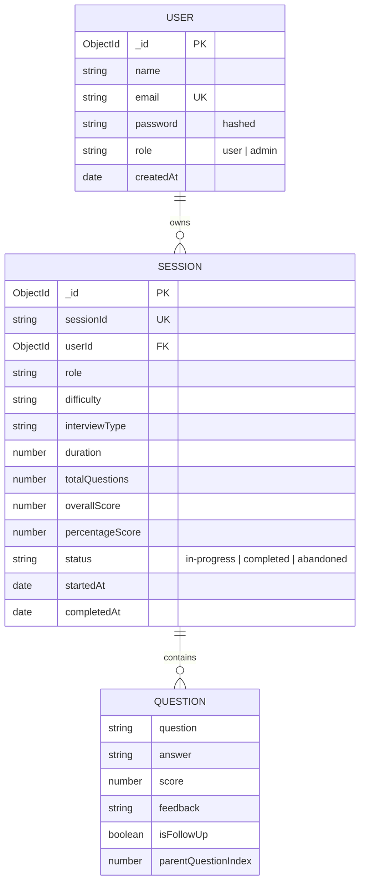

# NexRound: Database Schema Documentation

This document provides a detailed breakdown of the MongoDB collections and schemas used in the NexRound application.

## 1. Data Model Overview

The application follows a relational structure using MongoDB ObjectIds for linking sessions to users.

---

## 2. Collections

### 2.1 Users (`users`)
Stores user profiles and authentication details.

| Field | Type | Required | Description |
|---|---|---|---|
| `name` | String | Yes | User's full name. |
| `email` | String | Yes | Unique email (lowercased, trimmed). |
| `password` | String | Yes | Bcrypt hashed password (min length 6). |
| `role` | String | No | Defaults to 'user'. Can be 'admin'. |
| `createdAt` | Date | No | Timestamp of registration. |

### 2.2 Sessions (`sessions`)
Stores individual interview sessions.

| Field | Type | Required | Description |
|---|---|---|---|
| `sessionId` | String | Yes | Unique UUID for the session. |
| `userId` | ObjectId | Yes | Reference to the `User` who owns the session. |
| `role` | String | Yes | Target role (e.g., "Frontend Developer"). |
| `difficulty` | String | Yes | Junior, Mid, Senior, Lead. |
| `interviewType` | String | Yes | Technical, Behavioral, etc. |
| `duration` | Number | Yes | Expected duration in minutes. |
| `totalQuestions` | Number | No | Total count of questions asked. |
| `questions` | Array | No | List of `Question` objects (see below). |
| `overallScore` | Number | No | Final average score (0-10). |
| `percentageScore`| Number | No | Final score percentage (0-100). |
| `strengths` | Array[String]| No | Top 3 strengths from the session. |
| `improvements` | Array[String]| No | Top 3 areas for improvement. |
| `sampleAnswers` | Array[Object]| No | Improved sample answers for missed questions. |
| `suggestedTopics`| Array[String]| No | Recommended topics for future practice. |
| `status` | String | No | 'in-progress', 'completed', 'abandoned'. |
| `startedAt` | Date | No | Start timestamp. |
| `completedAt` | Date | No | Completion timestamp. |

#### Question Sub-schema
Nested within the `questions` array of a session.

| Field | Type | Required | Description |
|---|---|---|---|
| `question` | String | Yes | The generated interview question. |
| `answer` | String | No | User's provided answer. |
| `score` | Number | No | AI evaluation score (0-10) for this answer. |
| `feedback` | String | No | AI-generated feedback. |
| `isFollowUp` | Boolean | No | Indicates if this was a deep-dive follow-up. |
| `parentQuestionIndex`| Number | No | Index of the question this follow-up refers to. |

---

*Last Updated: February 15, 2026*
